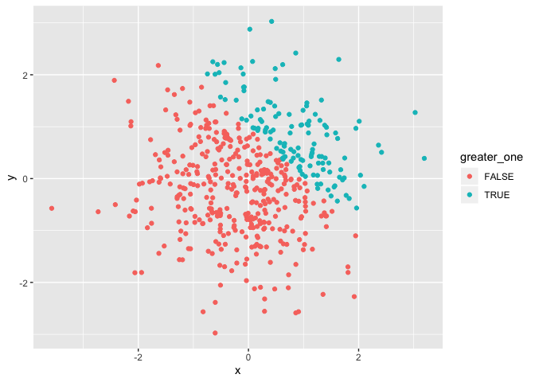
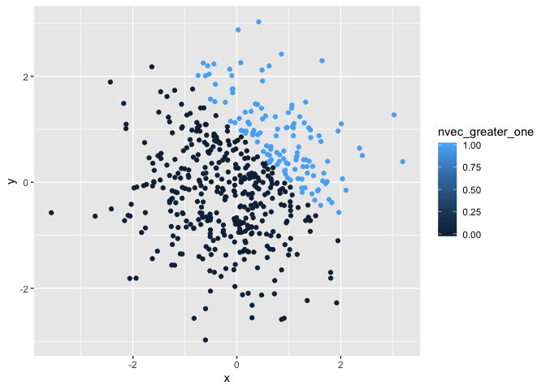
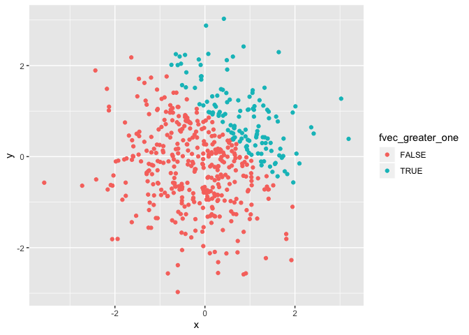

Homework 1
================
RuiJun Chen
2019-09-17

# Problem 1

Creating a data frame with random sample of size 8 from a standard
Normal distribution, logical vector indicating whether elements of the
sample are greater than 0, character vector of length 8, factor vector
of length 8, with 3 different factor “levels” (Code chunk with messages
off)

``` r
library(tidyverse)
p1_df = tibble (
  sample = rnorm(8),
  logic_vect = sample > 0,
  char_vect = c("a","b","c","d","e","f","g","h"),
  factor_vect = factor(c("low","medium","high","low","medium","high","low","medium"))
)
```

**Attempting to take the mean of each type of vector:**

The mean of numeric vector sample is 0.3427428

The mean of logical vector logic\_vect is 0.75

The mean of character vector char\_vect is NA

The mean of factor vector factor\_vect is NA

Mean works for numeric and logical vectors but not for charactor or
factor vectors, which returns NA instead

Code chunk to convert logical, character, and factor variables to
numeric (code chunk shown but no results):

``` r
as.numeric(pull(p1_df, logic_vect))
as.numeric(pull(p1_df, char_vect))
as.numeric(pull(p1_df, factor_vect))
```

Logical vectors convert to 0s and 1s, character vectors throw an error
and instead returns NA, and factor vectors convert to numbers for the
various ‘levels’ (in this case 1, 2, 3) based on alphabetical order.
This does explain why the mean does not work, as character vectors
cannot conver to numeric and while factor vectors can convert to
numeric, these are categorical variables which are assigned numbers
alphabetically and taking the mean of categorical variable is not
meaningful

**Second code chunk** to convert the logical vector to numeric, and
multiply the random sample by the result, convert the logical vector to
a factor, and multiply the random sample by the result, and convert the
logical vector to a factor and then convert the result to numeric, and
multiply the random sample by the
    result

``` r
pull(p1_df, sample)*as.numeric(pull(p1_df, logic_vect))
```

    ## [1] 0.2571343 0.5142921 0.5314079 1.3771320 0.8989601 0.0000000 0.1628986
    ## [8] 0.0000000

``` r
pull(p1_df, sample)*as.factor(pull(p1_df, logic_vect))
```

    ## Warning in Ops.factor(pull(p1_df, sample), as.factor(pull(p1_df,
    ## logic_vect))): '*' not meaningful for factors

    ## [1] NA NA NA NA NA NA NA NA

``` r
pull(p1_df, sample)*as.numeric(as.factor((pull(p1_df, logic_vect))))
```

    ## [1]  0.5142685  1.0285842  1.0628159  2.7542641  1.7979201 -0.7446324
    ## [7]  0.3257971 -0.2552499

# Problem 2

Create a data frame comprised of: x: a random sample of size 500 from a
standard Normal distribution y: a random sample of size 500 from a
standard Normal distribution A logical vector indicating whether x + y
\> 1 A numeric vector created by coercing the above logical vector A
factor vector created by coercing the above logical vector

``` r
p2_df = tibble(
  x = rnorm(500),
  y = rnorm(500),
  greater_one = (x + y) > 1,
  nvec_greater_one = as.numeric(greater_one),
  fvec_greater_one = as.factor(greater_one)
)
```

The dataframe created above has size of 500 rows and 5 columns. The mean
of x is 0.0136425, median of x is 0.0680012, and the standard deviation
of x is 0.9726537 The proportion of cases for which x + y \> 1 is 0.258

## Scatterplots

``` r
#Scatterplot by logic
logic_color_plot = ggplot(p2_df, aes(x = x, y = y, color = greater_one)) + geom_point()
logic_color_plot
```

<!-- -->

``` r
#Scatterplot by numeric
num_color_plot = ggplot(p2_df, aes(x = x, y = y, color = nvec_greater_one)) + geom_point()
num_color_plot
```

<!-- -->

``` r
#Scatterplot by factor
factor_color_plot = ggplot(p2_df, aes(x = x, y = y, color = fvec_greater_one)) + geom_point()
factor_color_plot
```

<!-- -->

``` r
ggsave(filename = "logic_color_plot.png", plot = logic_color_plot)
```

    ## Saving 7 x 5 in image

Color scales based on the logical vector and the factor vector are both
the same, with one color for TRUE and another for FALSE. When using the
numeric vector, the color scale in the legend has a spectrum from dark
for 0.00 to lighter blue for 1.00. However since the values are either 0
or 1 there are really still only 2 colors displayed on the plot
